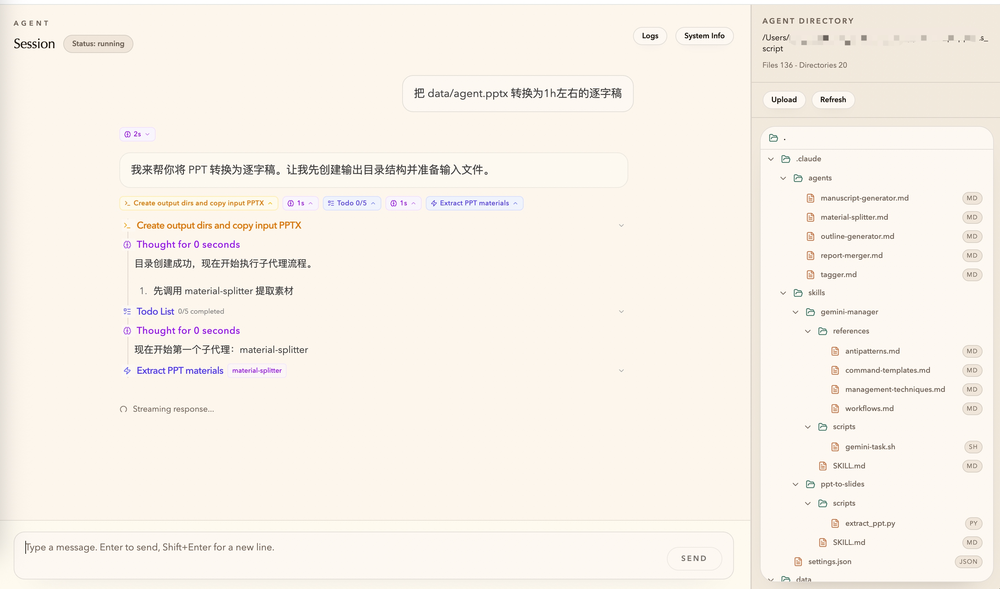

# Claude Agent Web UI

Browser-based UI + Bun HTTP/SSE server for agentic chat with the Claude Agent SDK.

## Why

This project provides a lightweight, single-process web UI for chatting with a Claude Agent running in a specified workspace directory. The agent runs locally and the UI is served in the browser from the same server and port.

## Prerequisites

- Install [Bun](https://bun.sh/) (package manager, scripts, and runtime).
- Configure Claude authentication in your agent directory (e.g. `.claude/settings.json`).

## Quick start

```bash
bun install
bun run start -- --agent-dir /path/to/agent
```

Then open `http://localhost:3000`.

## Commands

```bash
bun run server     # Start Bun HTTP/SSE server
bun run dev:web    # Start Vite dev server for Web UI
bun run build:web  # Build Web UI into dist/
bun run start      # Build Web UI and start server (single port)
bun run dev:single # Build Web UI in watch mode and start server (single port)

bun run start -- --agent-dir $(pwd)/agent
```

## Docker

```bash
docker build -t claude-agent-ui .
# modify the api key and base url in settings.json
cp agent/.claude/settings.json.tpl agent/.claude/settings.json

docker run --rm -p 8000:8000 \
    -v $(pwd)/agent:/home/node/claude-agent-ui/agent \
    -v $(pwd)/agent/.claude/settings.json:/home/node/claude-agent-ui/agent/.claude/settings.json \
    claude-agent-ui
```

## Screenshot


